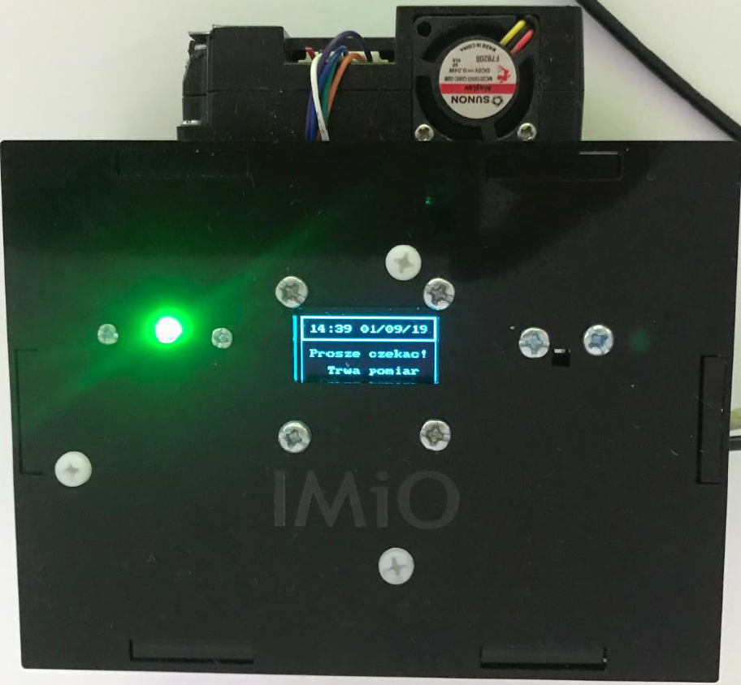

# Dust Sensor Project
This project was developed as part of an Engineer's Thesis.

The project focuses on measurement and documentation concentrations of PM2.5/PM10 and other parameters of meteorological, taking into account the location of the measuring station.  

<kbd></kbd>

# Description 
The project can be divided on parts:
* measuring device:
  - [Microcontroller ES8266](#microcontroller-ESP8266)
  - [Microcontroller Nucleo STM32F4](#microcontroller-nucleo-stm32f4)
  - others: optical sensor dust, sensor temperature, humidity and pressure, display OLED, reader card microSD, LED
* [Mobile Application](#mobile-application)
* [Server](#server)

## Description
The possibilities of this project are:
- measurement of concentrations PM2.5/PM10 using a optical dust sensor
- measurement meteorology parameters: air temperature, relative humidity and atmospheric pressure using digital sensor
- save measurement results on a microSD card
- save measurement results to MySQL Database
- determining location based on information about cell towers and WIFI nodes that the module WIFI can detect
- presentation of measurement results on build-in display

## Microcontroller ES8266
Microcontroller esp8266 is one of the most popular microcontroller which can act as module WIFI. 
<kbd></kbd>
Software ESP826 was developed using Arduino IDE.

Targets of ESP8266 are:
- connection with microSD card:
  * loading requiered data to do network connection and data for configuration
  * saving measurement results on a microSD card
- doing network connection:
  * determining location based on information about cell towers and WIFI nodes that the module WIFI can detect
  * loading configuration data from MySQL Database
  * saving measurement results to MySQL Database,
  * sending periodic information about the status of device
  
## Microcontroller Nucleo STM32F4
## Mobile Application
## Server
